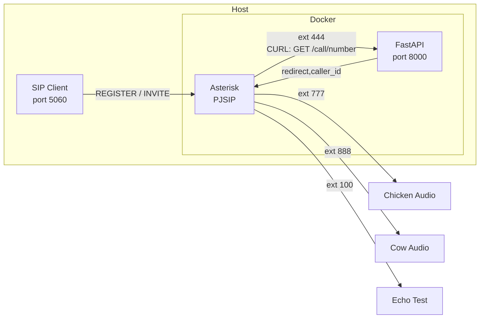
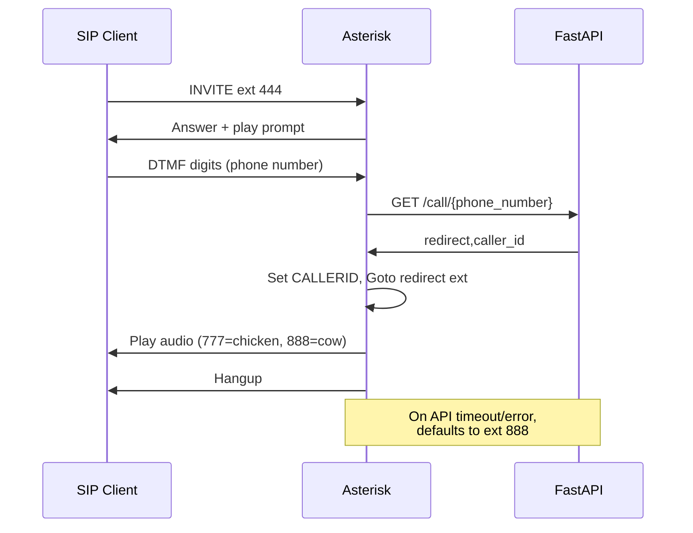

# Asterisk HTTP Routed Auto Attendant

## Architecture





## Setup

```
docker compose up -d --build
```

## Test Account

| Field | Value |
|-------|-------|
| Username | `6001` |
| Password | `test6001pass` |
| Server | Your host IP |
| Transport | UDP |

## Extensions

| Extension | Description |
|-----------|-------------|
| 100 | Echo test |
| 444 | Auto attendant - prompts for phone number, sends to API via HTTP |
| 777 | Plays chicken sound |
| 888 | Plays cow sound |

## API

FastAPI server on port 8000. Source is mounted with auto-reload.

`GET /call/{phone_number}` - called by extension 444 after collecting DTMF input.

## Ports

| Port | Protocol | Purpose |
|------|----------|---------|
| 5060 | UDP/TCP | SIP |
| 8000 | TCP | API |
| 10000-10004 | UDP | RTP |

2 RTP ports per call, so 5 ports = 2 concurrent calls.

### Expanding RTP range

1. `asterisk-config/rtp.conf` - change `rtpend`
2. `docker-compose.yml` - update port mapping to match
3. Update port forwarding rules if applicable

### Custom sounds

Drop 8kHz 16-bit mono `.wav` files into `sounds/`.
